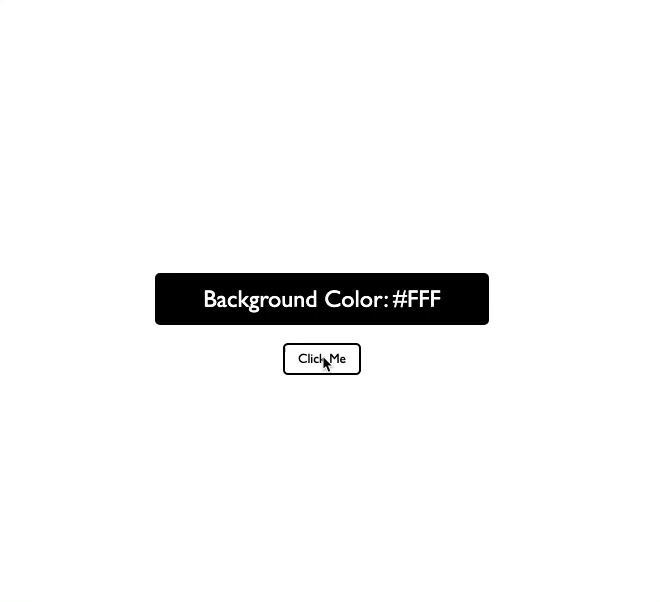
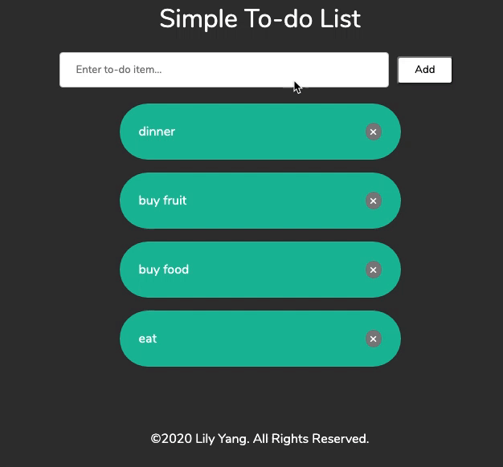

# Small Web Projects

This is a repo that contains all of my smaller web projects that are too small to be a repo on its own so I can practice the different skills I am learning, such as drag and drop API, using a new framework and testing things out, etc. 

# Table of Contents
  - [Color Change](#color-change)
  - [Simple React Todo App](#simple-react-todo-app)

## Color Change
- Technology used: Javascript, CSS, HTML
- Simple app that changes the color of the background with every click

## Simple React Todo App
- Technology used: React, CSS
- The cliche todo app using React for learning purposes

